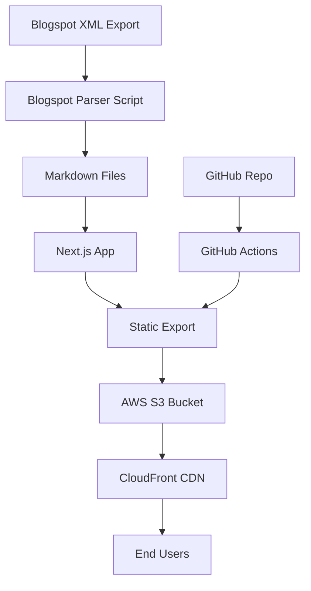

# Blogspot to Next.js Migration Plan

## Overview

Migrate your Blogspot blog to a Next.js static site hosted on AWS S3 + CloudFront. The blog will be built as a separate Next.js application in the `chrisfrantz-blog` repository with static export for optimal S3 hosting.

## Architecture



## Implementation Steps

### 1. Repository Setup
- Initialize Next.js project in `chrisfrantz-blog` repository
- Configure Next.js for static export (`output: 'export'`)
- Set up project structure with TypeScript (optional but recommended)
- Configure ESLint and Prettier

### 2. Blogspot Content Migration
- Create migration script (`scripts/migrate-blogspot.js`) to:
  - Parse Blogspot XML export file
  - Extract post metadata (title, date, author, labels/tags)
  - Convert HTML content to Markdown (using `turndown` or similar)
  - Handle images (download and store locally or use CDN)
  - Generate frontmatter for each post
  - Save posts as Markdown files in `content/posts/`
- Create post metadata index file for efficient querying

### 3. Next.js Blog Implementation
- **Pages Structure:**
  - `pages/index.js` - Blog listing page with pagination
  - `pages/posts/[slug].js` - Individual post page
  - `pages/tags/[tag].js` - Tag/category filtering
  - `pages/archive.js` - Archive page by date
- **Components:**
  - `components/PostCard.js` - Post preview card
  - `components/PostContent.js` - Post content renderer with markdown
  - `components/TagList.js` - Tag navigation
  - `components/Pagination.js` - Pagination controls
  - `components/Layout.js` - Site layout wrapper
- **Styling:**
  - Modern, responsive design using Tailwind CSS or CSS Modules
  - Dark mode support (optional)
  - Mobile-first approach

### 4. Content Management
- Use `gray-matter` to parse frontmatter from Markdown files
- Implement static generation with `getStaticProps` and `getStaticPaths`
- Create utility functions for:
  - Post sorting and filtering
  - Tag extraction and grouping
  - Date formatting
  - Slug generation

### 5. AWS S3 + CloudFront Setup
- **S3 Bucket Configuration:**
  - Create bucket with public read access
  - Configure bucket for static website hosting
  - Set up bucket policy for CloudFront access
  - Enable versioning (optional)
- **CloudFront Distribution:**
  - Create distribution pointing to S3 bucket
  - Configure custom domain (if applicable)
  - Set up SSL certificate via ACM
  - Configure caching rules
  - Set up error pages (404 handling)
- **IAM Roles:**
  - Create IAM user/role for deployment
  - Grant S3 upload and CloudFront invalidation permissions

### 6. Deployment Pipeline
- **GitHub Actions Workflow:**
  - Build Next.js static export
  - Upload to S3 bucket
  - Invalidate CloudFront cache
  - Optional: Set up preview deployments for PRs
- **Environment Variables:**
  - AWS credentials (stored as GitHub Secrets)
  - S3 bucket name
  - CloudFront distribution ID
  - Custom domain (if applicable)

### 7. SEO & Performance
- Add `next-seo` for meta tags and Open Graph
- Generate sitemap.xml
- Create robots.txt
- Implement RSS feed (`pages/feed.xml.js`)
- Optimize images (Next.js Image component or CloudFront)
- Add analytics (Google Analytics or similar)

### 8. Additional Features
- Search functionality (client-side or Algolia)
- Related posts suggestions
- Social sharing buttons
- Comment system (optional: Disqus, Giscus, or custom)
- Reading time estimation

## File Structure

```
chrisfrantz-blog/
├── content/
│   └── posts/
│       ├── 2024-01-15-my-first-post.md
│       └── ...
├── scripts/
│   └── migrate-blogspot.js
├── pages/
│   ├── index.js
│   ├── posts/
│   │   └── [slug].js
│   ├── tags/
│   │   └── [tag].js
│   ├── archive.js
│   └── feed.xml.js
├── components/
│   ├── Layout.js
│   ├── PostCard.js
│   ├── PostContent.js
│   ├── TagList.js
│   └── Pagination.js
├── lib/
│   ├── posts.js
│   └── utils.js
├── public/
│   ├── images/
│   └── favicon.ico
├── .github/
│   └── workflows/
│       └── deploy.yml
├── next.config.js
├── package.json
└── README.md
```

## Key Dependencies

- `next` - Next.js framework
- `react` & `react-dom` - React library
- `gray-matter` - Parse frontmatter
- `remark` & `remark-html` - Markdown processing
- `xml2js` or `fast-xml-parser` - Parse Blogspot XML
- `turndown` - HTML to Markdown conversion
- `aws-sdk` or `@aws-sdk/client-s3` - AWS S3 upload
- `@aws-sdk/client-cloudfront` - CloudFront invalidation
- `tailwindcss` (optional) - Styling

## Migration Considerations

1. **Images:** Blogspot images may need to be downloaded and re-hosted, or use Blogspot's CDN URLs
2. **Comments:** Decide if comments should be migrated or start fresh
3. **URLs:** Set up redirects from old Blogspot URLs to new structure (301 redirects)
4. **Content Cleanup:** HTML from Blogspot may need cleaning/sanitization
5. **Metadata:** Ensure all post metadata (dates, tags, authors) is preserved

## Next Steps After Migration

1. Test all posts render correctly
2. Verify image loading
3. Set up custom domain DNS
4. Submit new sitemap to search engines
5. Set up monitoring and analytics
6. Create backup strategy for content
